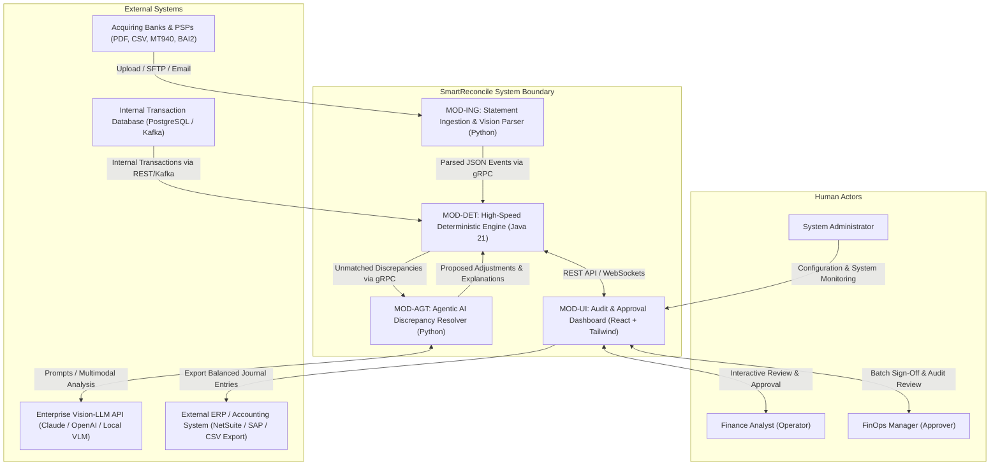

# System Context Diagram (Deliverable 1)

**Project:** SmartReconcile  
**Document ID:** D1-SYSTEM-CONTEXT  
**Phase:** 3 — Requirements Engineering (Layer 1)  

---

## 1. System Boundary Definition

**SmartReconcile** sits between internal transaction databases/event streams and external financial settlement data sources (acquirer bank statements, gateway payouts, FX feeds).

## 2. Mermaid System Context Diagram

## 3. External Interface Catalog

1. **Banking & PSP Interface:** Ingests MT940, BAI2, CSV, and PDF statements via SFTP, S3 bucket sync, or Web UI upload.
2. **Internal Transaction Feed:** Ingests internal payment attempts and authorized charges via PostgreSQL connection or Kafka events.
3. **Vision-LLM API Interface:** Sends anonymized PDF table slices and transaction metadata to enterprise Vision-LLMs over HTTPS TLS 1.3.
4. **ERP / Accounting Export:** Exports validated double-entry balancing journal entries as CSV / JSON for NetSuite, SAP, or QuickBooks integration.
