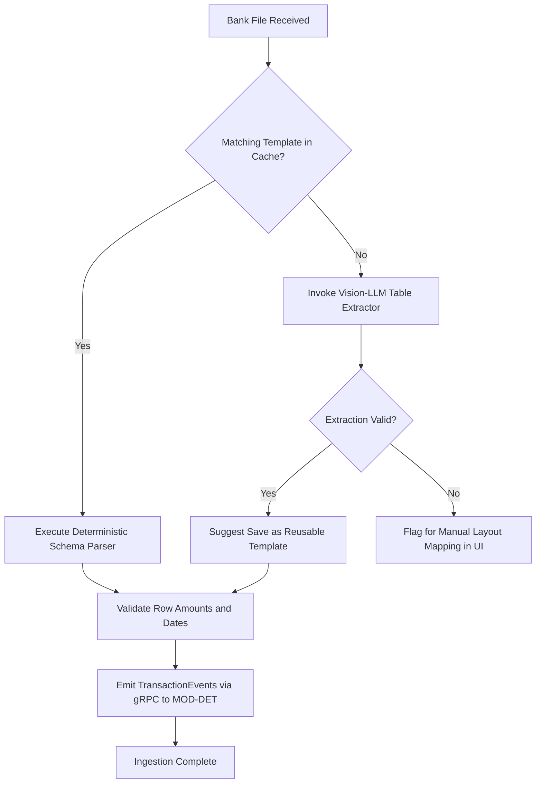

# Module Specification: MOD-ING (Statement Ingestion, Vision Parsing & Bank Template Manager)

### 1. Document Metadata
- **Project:** SmartReconcile
- **Phase:** 3 — Requirements Engineering
- **Deliverable:** Layer 2 — Module Specification (1 of 4)
- **Module:** `MOD-ING` (Bank Statement Ingestion, Vision-LLM Parsing & Bank Schema Template Manager `MOD-ING-TPL`)
- **Status:** Approved / Provisionally Closed

---

### 2. Base Requirements

#### 2.1 Functional Requirements (FR)
- **[CR-ING-01]** The system shall accept bank statement file uploads in PDF, CSV, MT940, and BAI2 formats via REST API and Web UI (`MOD-UI`).
- **[CR-ING-02]** The system (`MOD-ING-TPL`) shall extract the bank identifier and file signature to query the Redis/PostgreSQL template cache before initiating any parsing pipeline.
- **[CR-ING-03]** If a matching bank statement template exists in `MOD-ING-TPL`, the system shall parse the document deterministically in <100ms with zero LLM API calls.
- **[CR-ING-04]** If no matching template exists or if the file is an unstructured scanned PDF, the system shall invoke a Vision-Language Model (VLM) API (e.g., Llama-Vision / Claude 3.5 Sonnet / OpenAI GPT-4o) using a structured JSON Schema prompt.
- **[CR-ING-05]** The system shall extract standard transaction table attributes: Transaction Date, Posting Date, Transaction Reference ID, Description/Payee, Credit Amount, Debit Amount, Transaction Currency, and Balance.
- **[CR-ING-06]** The system (`MOD-ING-TPL`) shall allow human operators to preview VLM extraction results, manually map or correct column layouts, and save the configuration as a new reusable Bank Statement Template.
- **[CR-ING-07]** The system shall validate mathematical integrity per statement page ($\text{Opening Balance} + \sum \text{Credits} - \sum \text{Debits} = \text{Closing Balance}$) before emitting transaction events.
- **[CR-ING-08]** The system shall convert all validated transaction rows into standardized `BankTransactionEvent` Protobuf objects and emit them asynchronously to the Java core (`MOD-DET`) via gRPC over HTTP/2.

#### 2.2 Modular Non-Functional Requirements (NFR)
- **[NFR-ING-01] Performance (Deterministic Parsing):** Template-based parsing (`MOD-ING-TPL`) must process >5,000 transaction rows per second per CPU core.
- **[NFR-ING-02] Vision-LLM Accuracy:** Multimodal VLM table extraction must achieve ≥98.5% row and cell accuracy on 300 DPI scanned PDF statements.
- **[NFR-ING-03] Resilience & Fallback:** VLM API calls must implement a 10-second timeout, exponential backoff retries (max 2 attempts), and fall back to manual layout mapping in `MOD-UI` upon persistent failure.
- **[NFR-ING-04] Data Sanitization & PII Redaction:** PII attributes (account holder personal addresses, tax IDs) must be scrubbed prior to passing payload images or text to external LLM endpoints.

---

### 3. User Stories (User Stories)

| ID | As [Actor] | I Want [Action] | So That [Value] | FR Origin |
| --- | --- | --- | --- | --- |
| **US-ING-01** | Finance Analyst | Upload a monthly bank statement CSV or MT940 file via the web portal. | The system parses transactions instantly using cached templates without incurring AI API costs. | CR-ING-01, CR-ING-03 |
| **US-ING-02** | Finance Analyst | Upload a scanned PDF bank statement with complex multi-page tables. | The Vision-LLM extracts all transaction rows automatically into structured data. | CR-ING-04, CR-ING-05 |
| **US-ING-03** | FinOps Manager | Review AI-extracted PDF table rows side-by-side with the original statement page image. | I can verify column alignments and confirm extraction accuracy before ledger matching. | CR-ING-06 |
| **US-ING-04** | System Admin | Save a verified VLM extraction layout as a new reusable Bank Statement Template. | Future statements from that acquiring bank are parsed deterministically at zero AI cost. | CR-ING-02, CR-ING-06 |
| **US-ING-05** | Finance Analyst | Receive an alert if the statement page closing balance equation does not balance. | I am notified of missing or corrupted transaction rows before matching begins. | CR-ING-07 |
| **US-ING-06** | System Lead | Ensure statement ingestion streams transactions to Java core via gRPC. | Transaction matching executes with sub-millisecond latency. | CR-ING-08 |

---

### 4. Use Cases (Use Cases)

#### UC-ING-01: Statement Ingestion via Cached Bank Template (`MOD-ING-TPL`)
- **Actor:** Finance Analyst (`ACT-FIN`) / Automated Ingestion Worker (`SYS-ING`).
- **Trigger:** Analyst uploads a bank statement file (e.g., `Chase_Settlement_Aug2026.csv`).
- **Main Success Scenario:**
  1. Frontend sends POST `/api/v1/ingest/upload` with statement file.
  2. `SYS-ING` extracts file header signature and bank identifier.
  3. `SYS-ING` queries Redis cache for matching `BankTemplateSchema`. OK (Template found).
  4. `SYS-ING` executes deterministic Python CSV/MT940 parser using cached column mapping rules.
  5. `SYS-ING` validates statement balance equation ($\text{Opening} + \text{Net} = \text{Closing}$). OK.
  6. `SYS-ING` serializes transaction rows into `BankTransactionEvent` Protobuf objects.
  7. `SYS-ING` streams events via gRPC channel to Java core (`MOD-DET`).
  8. Returns HTTP 200 OK with ingestion summary JSON.
- **Exception Flows:**
  - **3a. Template Miss:** If no matching template exists, system routes payload to `UC-ING-02` (Vision-LLM Parsing).
  - **5a. Balance Validation Failure:** If net transactions do not match closing balance, marks batch status `CORRUPTED_STATEMENT` and flags row delta in `MOD-UI`.

#### UC-ING-02: Vision-LLM Parsing of Unstructured PDF Statement
- **Actor:** Automated System (`SYS-ING`) / External VLM API.
- **Trigger:** Ingestion worker receives an unmapped or scanned PDF statement.
- **Main Success Scenario:**
  1. `SYS-ING` converts PDF pages into 300 DPI PNG images using `PyMuPDF`.
  2. `SYS-ING` redacts non-financial PII headers.
  3. `SYS-ING` sends image slices to Vision-LLM API with strict JSON Schema prompt.
  4. VLM API returns structured JSON array of extracted transaction rows.
  5. `SYS-ING` validates row schema completeness (Date, RefID, Amount).
  6. `SYS-ING` stores extraction draft in PostgreSQL and notifies `MOD-UI` for template confirmation (`UC-ING-03`).
- **Exception Flows:**
  - **3a. VLM API Timeout / Error:** If VLM call times out (>10s), retries once. If second attempt fails, returns HTTP 504 and flags file as `MANUAL_PARSING_REQUIRED`.
  - **5a. Low Confidence Rows:** If cell confidence score is <90%, flags specific row cells in red on `MOD-UI` preview.

#### UC-ING-03: Create & Save Reusable Bank Statement Template (`MOD-ING-TPL`)
- **Actor:** FinOps Manager (`ACT-MGR`) / System Admin (`ACT-ADM`).
- **Trigger:** User opens VLM extraction preview in `MOD-UI` and clicks "Save as Reusable Template".
- **Main Success Scenario:**
  1. User reviews column assignments (e.g., Column 1 = Date, Column 3 = RefID, Column 5 = Amount).
  2. User defines bank name, file type (PDF/CSV), and header regex signature.
  3. Frontend sends POST `/api/v1/templates/create` with template schema JSON.
  4. `SYS-ING` validates schema syntax and stores template in PostgreSQL `bank_templates` table.
  5. `SYS-ING` invalidates and reloads Redis template cache.
  6. Retorna HTTP 201 Created.
- **Exception Flows:**
  - **3a. Duplicate Template Signature:** If regex signature collides with an existing bank template, returns HTTP 409 Conflict ("Template signature already registered").

---

### 5. Global Logical Activity Diagram (Ingestion & Template Orchestration)

---

### 6. Phase Gate Implication
- **Does it block progress?:** No.
- **Condition:** Proceed. The ingestion architecture successfully combines zero-cost deterministic template parsing (`MOD-ING-TPL`) with Vision-LLM fallback parsing. Data validation, balance checks, and gRPC payload schemas are fully specified for backend and frontend integration.
