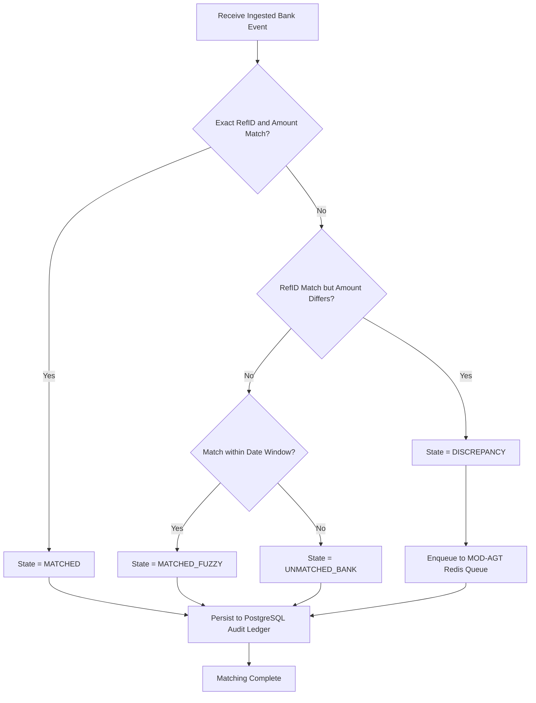

# Module Specification: MOD-DET (High-Speed Deterministic Matching Core)

### 1. Document Metadata
- **Project:** SmartReconcile
- **Phase:** 3 — Requirements Engineering
- **Deliverable:** Layer 2 — Module Specification (2 of 4)
- **Module:** `MOD-DET` (High-Speed Deterministic Matching Core Engine)
- **Status:** Approved / Provisionally Closed

---

### 2. Base Requirements

#### 2.1 Functional Requirements (FR)
- **[CR-DET-01]** The system shall ingest `BankTransactionEvent` Protobuf streams from `MOD-ING` via gRPC over HTTP/2.
- **[CR-DET-02]** The system shall ingest internal ledger transaction records from PostgreSQL / Kafka event pipelines.
- **[CR-DET-03]** The system shall execute in-memory exact key matching (Reference ID + Exact Transaction Amount + Currency) using Java 21 Virtual Threads (`Executors.newVirtualThreadPerTaskExecutor()`).
- **[CR-DET-04]** The system shall execute windowed fuzzy matching (Reference ID Match + Date ±3 days window + Amount Tolerance ±$0.05) for non-exact reference hits.
- **[CR-DET-05]** The system shall categorize every processed transaction pair into exactly one of 4 state flags: `MATCHED`, `UNMATCHED_INTERNAL`, `UNMATCHED_BANK`, or `DISCREPANCY`.
- **[CR-DET-06]** The system shall push all `DISCREPANCY` payloads (where Reference ID matches but Amount differs by $\Delta$) to an asynchronous Redis queue for processing by `MOD-AGT`.
- **[CR-DET-07]** The system shall validate all AI-proposed balancing journal entries received from `MOD-AGT` against strict double-entry accounting rules ($\sum \text{Debits} = \sum \text{Credits}$) before committing entries to PostgreSQL.
- **[CR-DET-08]** The system shall throw an `InvalidAccountingEntryException` and reject any AI proposal where Debits do not equal Credits, logging the rejected proposal in the audit table.
- **[CR-DET-09]** The system shall record immutable, append-only audit trail logs for every matched pair, discrepancy state change, and operator adjustment sign-off.

#### 2.2 Modular Non-Functional Requirements (NFR)
- **[NFR-DET-01] Throughput Performance:** The Java engine core must sustain **>10,000 Transactions Per Second (TPS)** per node under batch load conditions.
- **[NFR-DET-02] In-Memory Matching Latency:** Sub-millisecond execution (**<1.0 ms**) per transaction pair for exact index lookups.
- **[NFR-DET-03] Zero False-Positive Rate:** Deterministic matching accuracy must maintain a **0.00% false-positive match rate** (100% precision).
- **[NFR-DET-04] High Availability & Fault Isolation:** `MOD-DET` uptime must maintain 99.95%; downtime in `MOD-AGT` (Python AI) must never block or crash `MOD-DET` batch ingestion.

---

### 3. User Stories (User Stories)

| ID | As [Actor] | I Want [Action] | So That [Value] | FR Origin |
| --- | --- | --- | --- | --- |
| **US-DET-01** | FinOps Manager | 100,000 daily transaction records matched against bank statements in under 10 seconds. | Accounting books are updated instantaneously without server lag. | CR-DET-01, CR-DET-03 |
| **US-DET-02** | Finance Analyst | The system to automatically categorize unmatched items into `UNMATCHED_INTERNAL` vs `UNMATCHED_BANK`. | I can immediately distinguish missing bank deposits from unrecorded internal charges. | CR-DET-05 |
| **US-DET-03** | Systems Architect | Java core to validate that all AI-proposed balancing entries satisfy $\text{Debits} = \text{Credits}$. | LLM hallucinations can never write unbalanced figures into the production accounting database. | CR-DET-07, CR-DET-08 |
| **US-DET-04** | Compliance Auditor | Export an immutable audit trail showing exact matching rules and timestamped operator approvals. | I can verify compliance with SOC-1 and SOC-2 Type II audit standards. | CR-DET-09 |
| **US-DET-05** | Finance Analyst | Automatically dispatch amount discrepancy items ($\Delta \neq 0$) to the AI agent queue. | Root-cause analysis begins immediately without waiting for human assignment. | CR-DET-06 |

---

### 4. Use Cases (Use Cases)

#### UC-DET-01: High-Speed Batch Deterministic Matching
- **Actor:** Automated System (`SYS-DET`).
- **Trigger:** `MOD-ING` initiates a gRPC `StreamBankEvents` RPC call.
- **Main Success Scenario:**
  1. `SYS-DET` receives batch stream of `BankTransactionEvent` objects.
  2. Virtual thread pool fetches candidate internal transactions from Redis in-memory index.
  3. `SYS-DET` compares exact key: `RefID + Amount + Currency`. Coincide.
  4. `SYS-DET` sets transaction state = `MATCHED`.
  5. `SYS-DET` writes match record to PostgreSQL audit table inside a single database transaction.
  6. `SYS-DET` updates real-time KPI metrics in Redis (`% Matched`, `TPS Rate`).
  7. Retorna gRPC `BatchStreamResponse` (Success).
- **Exception Flows:**
  - **3a. Amount Discrepancy ($\Delta \neq 0$):** RefID matches but Amount differs. Sets state = `DISCREPANCY`, serializes payload to JSON, and pushes item to Redis queue `queue:discrepancies:ai`.
  - **3b. No RefID Match:** Performs fuzzy window search (Date ±3 days, Amount ±$0.05). If fuzzy match succeeds, sets state = `MATCHED_FUZZY`. If window search fails, sets state = `UNMATCHED_BANK`.

#### UC-DET-02: Double-Entry Validation of AI Journal Proposals
- **Actor:** Automated System (`SYS-DET`) / AI Agent (`SYS-AGT`).
- **Trigger:** `MOD-AGT` submits a proposed journal entry via gRPC `SubmitAdjustmentProposal`.
- **Main Success Scenario:**
  1. `SYS-DET` receives `JournalEntryProposal` payload containing array of Debit/Credit line items.
  2. `SYS-DET` sums all Debit entries ($\sum D$) and Credit entries ($\sum C$).
  3. `SYS-DET` verifies $\sum D == \sum C$ and $\sum D > 0$. Coincide.
  4. `SYS-DET` stores entry with status `PENDING_OPERATOR_APPROVAL` in PostgreSQL.
  5. `SYS-DET` emits WebSocket event to `MOD-UI` for analyst sign-off.
  6. Retorna gRPC `ProposalAck` (Status: `VALIDATED`).
- **Exception Flows:**
  - **3a. Accounting Imbalance ($\sum D \neq \sum C$):** If Debits do not equal Credits, throws `InvalidAccountingEntryException`. Sets proposal status = `REJECTED_VALIDATION_FAILURE`, logs rejection event, and alerts `MOD-UI`.

---

### 5. Global Logical Activity Diagram (Deterministic Matching & Validation)

---

### 6. Phase Gate Implication
- **Does it block progress?:** No.
- **Condition:** Proceed. The core matching engine specifications guarantee 10,000+ TPS performance in Java 21, sub-millisecond latency, zero false positives, and strict double-entry validation guardrails to prevent AI hallucination corruptions in production databases.
