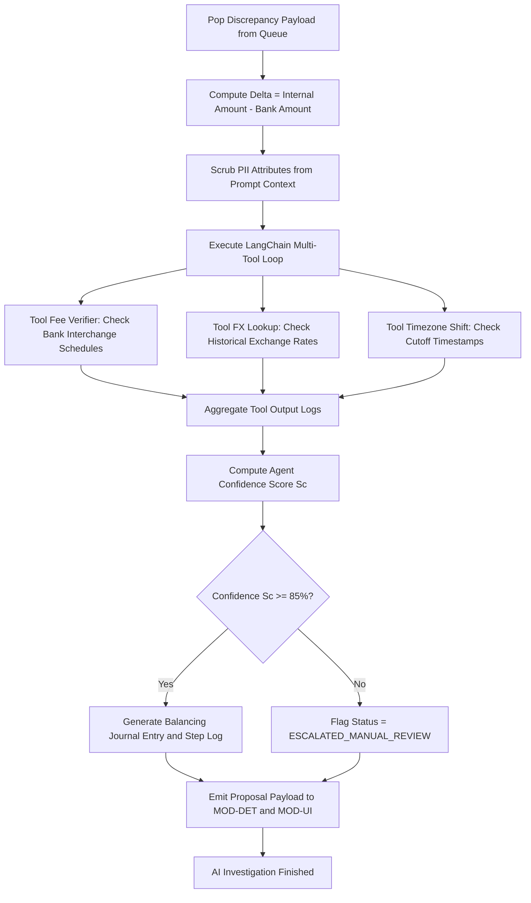

# Module Specification: MOD-AGT (Agentic AI Discrepancy Resolution Engine)

### 1. Document Metadata
- **Project:** SmartReconcile
- **Phase:** 3 — Requirements Engineering
- **Deliverable:** Layer 2 — Module Specification (3 of 4)
- **Module:** `MOD-AGT` (Agentic AI Discrepancy Resolution Engine)
- **Status:** Approved / Provisionally Closed

---

### 2. Base Requirements

#### 2.1 Functional Requirements (FR)
- **[CR-AGT-01]** The system shall asynchronously pop `DISCREPANCY` payload items from the Redis queue populated by `MOD-DET`.
- **[CR-AGT-02]** The AI agent shall execute multi-tool investigations using custom Python tools:
  - **`Tool_FX_Lookup`:** Queries historical exchange rates (ECB / Open Exchange Rates API) for cross-border transaction dates.
  - **`Tool_Fee_Verifier`:** Inspects acquiring bank fee schedules for unannounced interchange or cross-border surcharges.
  - **`Tool_Timezone_Shift`:** Normalizes UTC vs. local bank cutoff timestamps to detect day-boundary shifts.
- **[CR-AGT-03]** The system shall calculate the mathematical discrepancy delta ($\Delta = Amount_{internal} - Amount_{bank}$) and map the delta against candidate root causes.
- **[CR-AGT-04]** The system shall classify the root cause into a standard typology: `UNANNOUNCED_BANK_FEE`, `FX_RATE_VARIANCE`, `TIMEZONE_CUTOFF_SHIFT`, `DYNAMIC_CURRENCY_CONVERSION`, or `UNKNOWN_DISCREPANCY`.
- **[CR-AGT-05]** The system shall construct a proposed balancing double-entry journal proposal (e.g., Debit: Bank Fee Expense Account #5100, Credit: Clearing Account #1150).
- **[CR-AGT-06]** The system shall generate a step-by-step mathematical reasoning log explaining the diagnostic in clear natural language.
- **[CR-AGT-07]** The system shall calculate an Agent Confidence Score ($0\% \le S_c \le 100\%$). If $S_c < 85\%$, the system shall flag the item for manual human investigation in `MOD-UI` without proposing an automated adjustment.
- **[CR-AGT-08]** The system shall transmit validated adjustment proposals and reasoning logs via gRPC to `MOD-DET` and `MOD-UI`.

#### 2.2 Modular Non-Functional Requirements (NFR)
- **[NFR-AGT-01] Resolution Latency:** AI agent analysis and tool execution must complete in **<30 seconds** per discrepancy item.
- **[NFR-AGT-02] Diagnostic Precision:** Root-cause categorization accuracy must exceed **≥95.0%** on benchmark test suites.
- **[NFR-AGT-03] Security & PII Protection:** Prompts and payloads sent to external LLMs must contain zero unhashed customer names, emails, tax IDs, or full card numbers.
- **[NFR-AGT-04] Asynchronous Decoupling:** AI processing downtime or high LLM API latency must never block Java `MOD-DET` batch ingestion.

---

### 3. User Stories (User Stories)

| ID | As [Actor] | I Want [Action] | So That [Value] | FR Origin |
| --- | --- | --- | --- | --- |
| **US-AGT-01** | Finance Analyst | The AI agent to explain why a $100 charge resulted in a $96.50 bank deposit. | I don't have to manually search through bank fee contracts or cross-border schedules. | CR-AGT-02, CR-AGT-04 |
| **US-AGT-02** | Senior Accountant | The AI agent to generate a complete double-entry balancing entry for fee discrepancies. | I can balance the ledger with a single click in `MOD-UI`. | CR-AGT-05 |
| **US-AGT-03** | FinOps Manager | The AI agent to step-by-step document its mathematical reasoning. | External auditors can verify the exact logic behind every ledger adjustment. | CR-AGT-06 |
| **US-AGT-04** | Compliance Officer | The system to escalate discrepancies to human operators whenever AI confidence is <85%. | Unclear or suspicious transaction variances are never automatically adjusted. | CR-AGT-07 |

---

### 4. Use Cases (Use Cases)

#### UC-AGT-01: Investigate Unannounced Bank Fee Discrepancy
- **Actor:** Automated AI Agent (`SYS-AGT`).
- **Trigger:** Worker pops item from `queue:discrepancies:ai` ($Amount_{internal} = \$100.00, Amount_{bank} = \$96.50$).
- **Main Success Scenario:**
  1. `SYS-AGT` calculates delta $\Delta = \$100.00 - \$96.50 = \$3.50$.
  2. `SYS-AGT` invokes `Tool_Fee_Verifier` passing Acquirer ID `ACQ-VISA-INTL`.
  3. Tool returns active fee schedule: 3.5% tier-2 cross-border interchange fee.
  4. `SYS-AGT` validates formula: $\$100.00 \times (1 - 0.035) = \$96.50$. Math matches exactly.
  5. `SYS-AGT` assigns root cause = `UNANNOUNCED_BANK_FEE` and sets Confidence Score $S_c = 98\%$.
  6. `SYS-AGT` constructs balancing journal entry:
     - Debit Account #5100 (Bank Fee Expense): $3.50
     - Credit Account #1150 (Gateway Clearing): $3.50
  7. `SYS-AGT` generates step-by-step reasoning markdown text.
  8. `SYS-AGT` emits proposal payload via gRPC to `MOD-DET` and `MOD-UI`.
- **Exception Flows:**
  - **3a. Fee Tool Return Miss:** If fee tool does not explain delta, agent invokes `Tool_FX_Lookup`. If FX rate matches delta, assigns root cause = `FX_RATE_VARIANCE`. If both tools fail, sets Confidence Score $S_c = 45\%$ and triggers `UC-AGT-02` (Manual Escalation).

#### UC-AGT-02: Manual Escalation for Low-Confidence Discrepancies
- **Actor:** Automated AI Agent (`SYS-AGT`) / Finance Analyst (`ACT-FIN`).
- **Trigger:** Agent investigation yields Confidence Score $S_c < 85\%$.
- **Main Success Scenario:**
  1. `SYS-AGT` marks proposal status = `ESCALATED_MANUAL_REVIEW`.
  2. `SYS-AGT` attaches preliminary tool logs (FX rates checked, fee tables queried).
  3. `SYS-AGT` sends payload to `MOD-UI` flagged in amber/red alert color.
  4. Analyst opens item in `MOD-UI`, reviews logs, and manually inputs adjustment numbers or contacts bank.
- **Exception Flows:**
  - **4a. Analyst Overrides AI Category:** Analyst selects correct category from dropdown in `MOD-UI`. System logs override to retrain agent prompt rules.

---

### 5. Global Logical Activity Diagram (Agentic AI Investigation Pipeline)

---

### 6. Phase Gate Implication
- **Does it block progress?:** No.
- **Condition:** Proceed. The agentic AI coprocessor specifications establish multi-tool investigation capabilities, automated double-entry proposal generation, and strict <85% confidence score escalation guardrails to ensure auditability.
