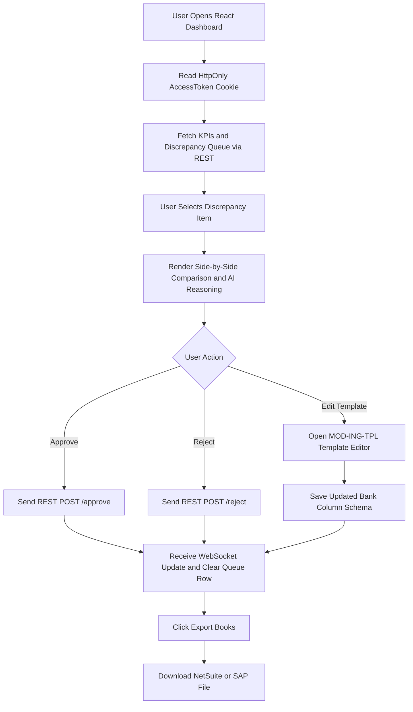

# Module Specification: MOD-UI (Operator Audit, Approval & Bank Template Dashboard)

### 1. Document Metadata
- **Project:** SmartReconcile
- **Phase:** 3 — Requirements Engineering
- **Deliverable:** Layer 2 — Module Specification (4 of 4)
- **Module:** `MOD-UI` (Operator Audit, Approval Dashboard & Bank Template Manager UI `MOD-ING-TPL`)
- **Status:** Approved / Provisionally Closed

---

### 2. Base Requirements

#### 2.1 Functional Requirements (FR)
- **[CR-UI-01]** The system shall render a responsive Single-Page Application (SPA) dashboard using React.js and Tailwind CSS.
- **[CR-UI-02]** The system shall display real-time reconciliation KPIs: Total Ingested Transactions, % Matched Rate, Discrepancies Pending, Total Financial Leakage Recovered ($), and System TPS Throughput.
- **[CR-UI-03]** The system shall provide an interactive Discrepancy Review Panel displaying side-by-side transaction line items (Internal vs. Bank) and step-by-step AI reasoning logs generated by `MOD-AGT`.
- **[CR-UI-04]** The system shall provide one-click "Approve Adjustment" and "Reject Adjustment" actions for finance operators, transmitting authorization tokens to `MOD-DET`.
- **[CR-UI-05]** The system shall incorporate a dedicated Bank Schema Template Manager interface (`MOD-ING-TPL`) allowing operators to visually drag-and-drop column mappings, test sample bank statement files, and save reusable parsing schemas.
- **[CR-UI-06]** The system shall provide an interactive Audit Log Viewer filtered by Date Range, Operator ID, Discrepancy Type, and Approval Status.
- **[CR-UI-07]** The system shall export approved balancing journal entries as NetSuite / SAP / QuickBooks compatible CSV or JSON files.
- **[CR-UI-08]** The system shall enforce JWT token authentication with HttpOnly cookies, RBAC role restrictions (`ROLE_ANALYST`, `ROLE_MANAGER`, `ROLE_ADMIN`), and automatic session refresh.

#### 2.2 Modular Non-Functional Requirements (NFR)
- **[NFR-UI-01] First Contentful Paint (FCP):** SPA initial page load FCP must complete in **<1.2 seconds**.
- **[NFR-UI-02] Real-Time UI Responsiveness:** User actions and WebSocket KPI updates must reflect on the screen in **<200ms**.
- **[NFR-UI-03] Accessibility & Responsive Design:** Interface must render accessibly on screen resolutions from 1920x1080 to 1280x720 using Tailwind CSS dark-mode/light-mode themes.
- **[NFR-UI-04] Security & XSS Protection:** Storage of JWT access tokens in `localStorage` is strictly prohibited; all state mutations must require CSRF header tokens.

---

### 3. User Stories (User Stories)

| ID | As [Actor] | I Want [Action] | So That [Value] | FR Origin |
| --- | --- | --- | --- | --- |
| **US-UI-01** | Finance Analyst | View a real-time dashboard of today's reconciliation progress and pending discrepancy queue. | I can immediately prioritize high-value unmatched items. | CR-UI-01, CR-UI-02 |
| **US-UI-02** | Finance Analyst | Inspect AI step-by-step reasoning logs side-by-side with original bank statement line items. | I can verify the mathematical logic before approving an adjustment. | CR-UI-03 |
| **US-UI-03** | FinOps Manager | Approve high-value balancing entries (>$1,000) with a single click. | Balanced entries post directly to the ledger without manual data entry. | CR-UI-04 |
| **US-UI-04** | System Admin | Visually map bank statement columns using the `MOD-ING-TPL` template studio. | Future statement uploads from that bank parse deterministically at zero AI cost. | CR-UI-05 |
| **US-UI-05** | Compliance Auditor | Filter and export timestamped audit logs for all operator approvals over the past quarter. | I can verify compliance with SOC-2 audit requirements. | CR-UI-06 |
| **US-UI-06** | FinOps Manager | Export approved journal entries directly to NetSuite CSV format. | I can import balanced entries into our ERP system with zero formatting errors. | CR-UI-07 |

---

### 4. Use Cases (Use Cases)

#### UC-UI-01: Review and Approve AI Discrepancy Proposal
- **Actor:** Finance Analyst (`ACT-FIN`) / FinOps Manager (`ACT-MGR`).
- **Trigger:** Operator clicks a discrepancy item in the pending review queue.
- **Main Success Scenario:**
  1. Frontend fetches item details via GET `/api/v1/discrepancies/{id}`.
  2. React UI renders side-by-side panel: Internal Charge ($100.00) vs. Bank Settlement ($96.50).
  3. UI displays AI reasoning card: *"Unannounced 3.5% cross-border fee applied by Acquirer."*
  4. UI displays proposed balancing entry: Debit #5100 ($3.50), Credit #1150 ($3.50).
  5. Operator clicks "Approve Adjustment".
  6. React UI sends POST `/api/v1/discrepancies/{id}/approve` with CSRF token.
  7. Backend (`MOD-DET`) validates double-entry, writes audit log, and marks status = `RESOLVED_APPROVED`.
  8. React UI displays success toast and updates queue metrics via WebSocket.
- **Exception Flows:**
  - **5a. Operator Rejects Proposal:** Operator clicks "Reject", selects reason ("Incorrect Fee Category"), and inputs manual adjustment figures. UI sends POST `/api/v1/discrepancies/{id}/reject`.

#### UC-UI-02: Create & Test Bank Statement Parsing Schema (`MOD-ING-TPL`)
- **Actor:** System Admin (`ACT-ADM`).
- **Trigger:** Admin opens "Bank Template Studio" tab in React UI.
- **Main Success Scenario:**
  1. Admin drops sample bank CSV file into upload zone.
  2. UI parses header rows and displays sample data table.
  3. Admin assigns dropdown mappers (Col 1 = Transaction Date, Col 2 = Reference ID, Col 4 = Amount).
  4. Admin specifies date format (`YYYY-MM-DD`) and decimal separator (`.`).
  5. Admin clicks "Dry Run Test".
  6. Backend (`MOD-ING-TPL`) parses sample file and returns preview table. OK (100% rows matched).
  7. Admin clicks "Save & Publish Template".
  8. React UI sends POST `/api/v1/templates` and updates template list.
- **Exception Flows:**
  - **6a. Dry Run Parsing Error:** If sample rows fail date/amount parsing, UI highlights failing cells in red and displays error message ("Invalid date format in Row 5").

---

### 5. Global Logical Activity Diagram (React UI State & User Workflow)

---

### 6. Phase Gate Implication
- **Does it block progress?:** No.
- **Condition:** Proceed. The UI dashboard specifications establish responsive React + Tailwind CSS components, interactive AI reasoning cards, visual bank template management (`MOD-ING-TPL`), and strict security (HttpOnly cookies, CSRF protection) ready for frontend implementation.
