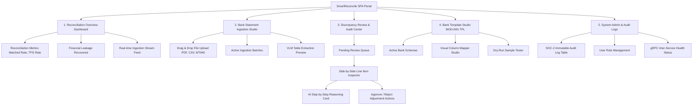

# Deliverable 1: Content Strategy & Information Architecture [GLOBAL]

**Project:** SmartReconcile  
**Document ID:** D1-INFORMATION-ARCHITECTURE  
**Phase:** 4 — System Modeling (Track A)  

---

## 1. Information Architecture & Sitemap Diagram

The React + Tailwind CSS Single-Page Application (SPA) is structured around four primary navigation hubs:

## 2. Content Taxonomy & Status Identifiers

- **Reconciliation Statuses:** `MATCHED` (Green), `MATCHED_FUZZY` (Blue), `DISCREPANCY` (Amber), `UNMATCHED_INTERNAL` (Purple), `UNMATCHED_BANK` (Orange), `CORRUPTED` (Red).
- **Discrepancy Root-Cause Categories:** `UNANNOUNCED_BANK_FEE`, `FX_RATE_VARIANCE`, `TIMEZONE_CUTOFF_SHIFT`, `DYNAMIC_CURRENCY_CONVERSION`, `UNKNOWN_DISCREPANCY`.
- **Template Statuses:** `DRAFT`, `TESTED_OK`, `ACTIVE_PRODUCTION`, `DEPRECATED`.

## 3. Global Navigation Rules

1. **Header Navigation:** Fixed navbar rendering active tenant, connected bank accounts, real-time WebSocket connection status badge, and user profile avatar.
2. **Side Navigation:** Collapsible left sidebar providing instant 1-click access to Dashboard, Ingestion, Discrepancies, Templates, and Audit Logs.
3. **Contextual Action Bar:** Floating action drawer appearing during discrepancy reviews or template mapping runs.
