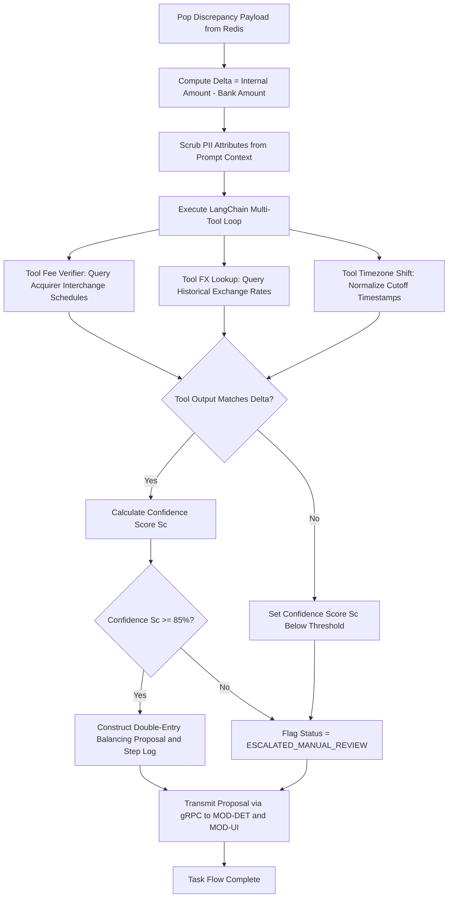

# Deliverable 2: User Flows & Task Flows [MODULE: MOD-AGT]

**Module Code:** `MOD-AGT` (Agentic AI Discrepancy Resolution Engine)  
**Document ID:** D2-USER-FLOWS-MOD-AGT  
**Phase:** 4 — System Modeling (Track A)  

---

## 1. Task Flow 1: Multi-Tool AI Investigation & Proposal Generation

