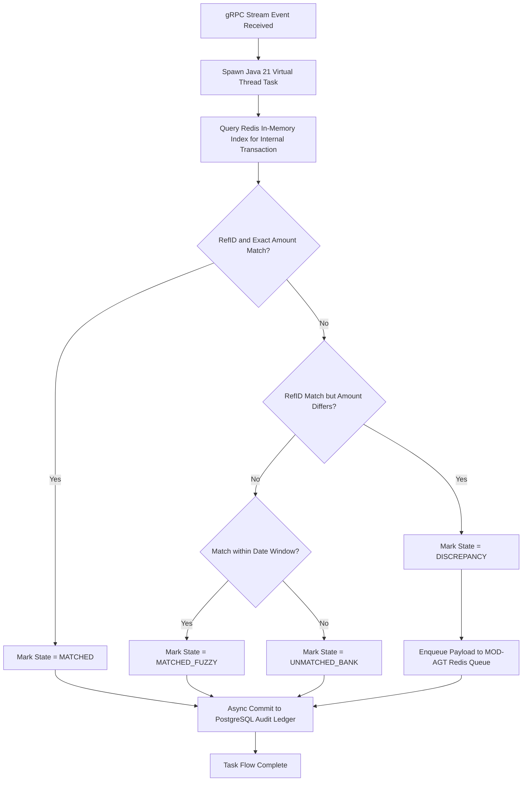
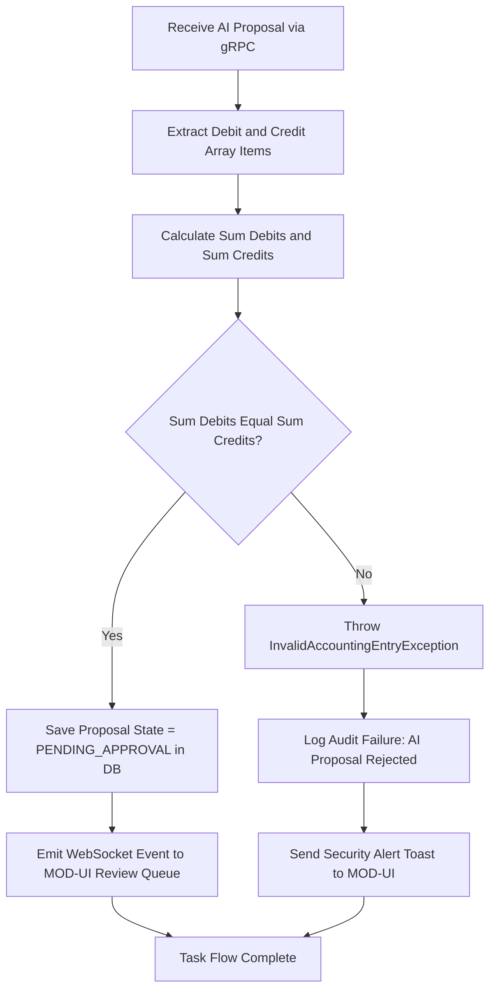

# Deliverable 2: User Flows & Task Flows [MODULE: MOD-DET]

**Module Code:** `MOD-DET` (High-Speed Deterministic Matching Core)  
**Document ID:** D2-USER-FLOWS-MOD-DET  
**Phase:** 4 — System Modeling (Track A)  

---

## 1. Task Flow 1: Sub-Millisecond Event Ingestion & In-Memory Matching

## 2. Task Flow 2: Double-Entry Validation of AI Journal Proposals

