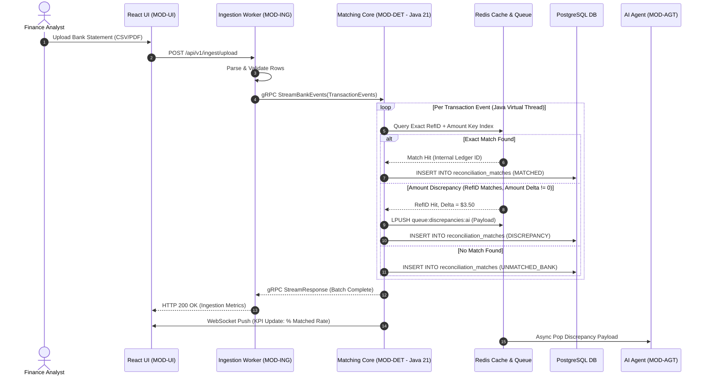
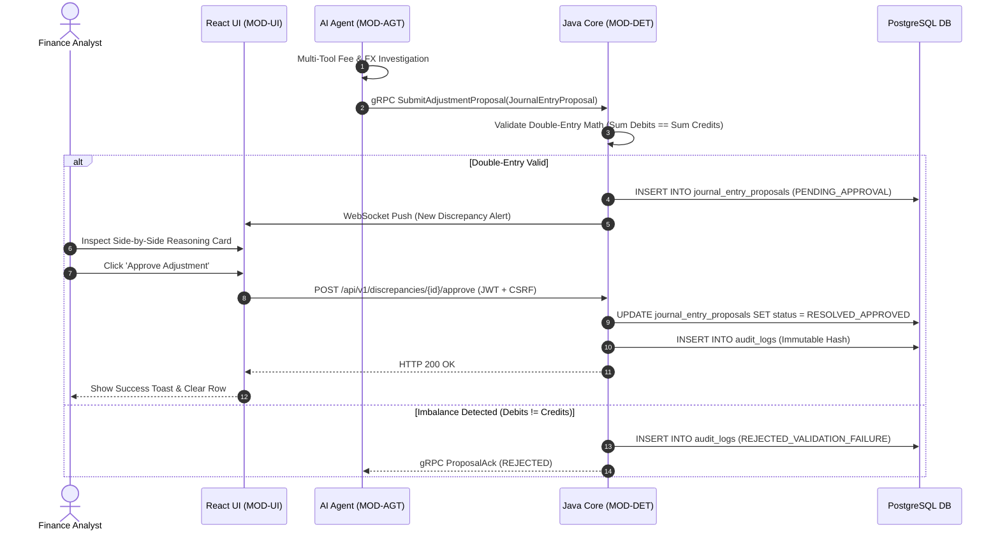

# Deliverable 7: System Sequence Diagrams [MODULE: MOD-DET]

**Module Code:** `MOD-DET`  
**Document ID:** D7-SEQUENCE-DIAGRAMS-MOD-DET  
**Phase:** 4 — System Modeling (Track B)  

---

## 1. System Sequence Diagram: High-Speed Ingestion & Deterministic Match Stream

## 2. System Sequence Diagram: AI Proposal Validation & Operator Sign-Off

