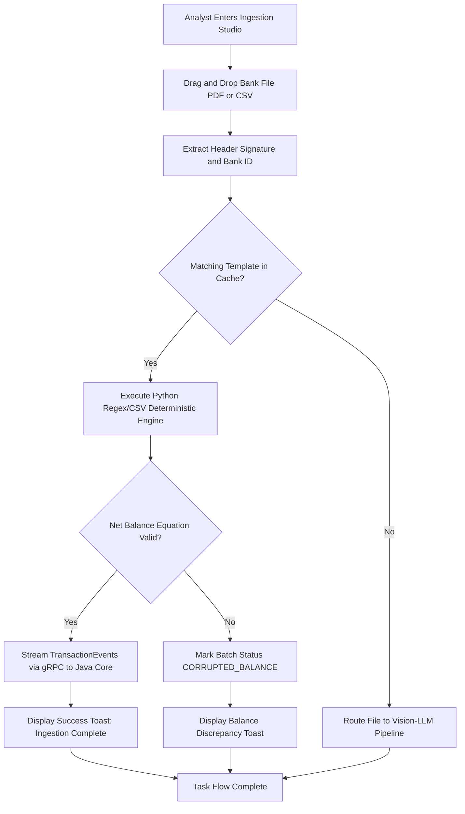
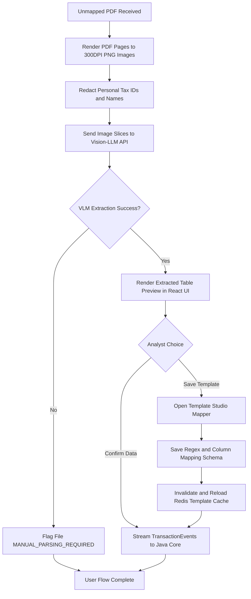

# Deliverable 2: User Flows & Task Flows [MODULE: MOD-ING]

**Module Code:** `MOD-ING` (Statement Ingestion, Vision Parsing & Bank Template Manager)  
**Document ID:** D2-USER-FLOWS-MOD-ING  
**Phase:** 4 — System Modeling (Track A)  

---

## 1. Task Flow 1: Bank Statement Upload & Deterministic Fast-Parse (MOD-ING-TPL)

## 2. User Flow 2: AI Vision Parsing & Reusable Template Creation

