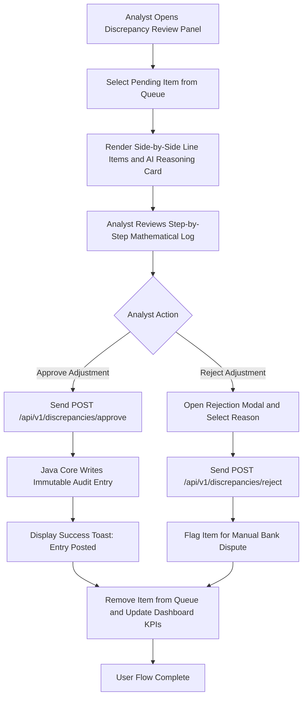
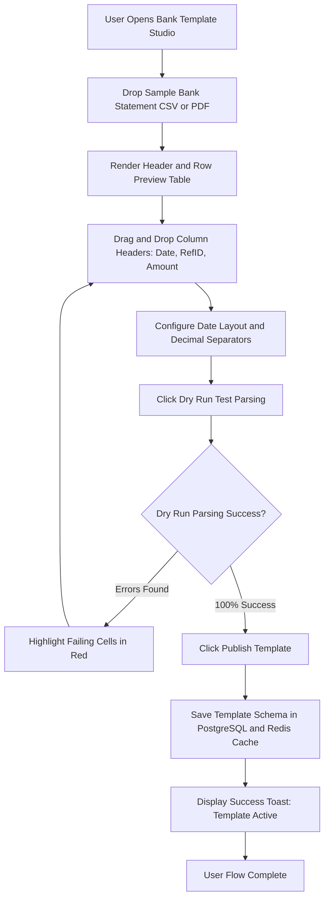

# Deliverable 2: User Flows & Task Flows [MODULE: MOD-UI]

**Module Code:** `MOD-UI` (Operator Audit & Approval Dashboard)  
**Document ID:** D2-USER-FLOWS-MOD-UI  
**Phase:** 4 — System Modeling (Track A)  

---

## 1. User Flow 1: Interactive Discrepancy Review & Single-Click Approval

## 2. User Flow 2: Bank Statement Template Studio (MOD-ING-TPL) Workflow

