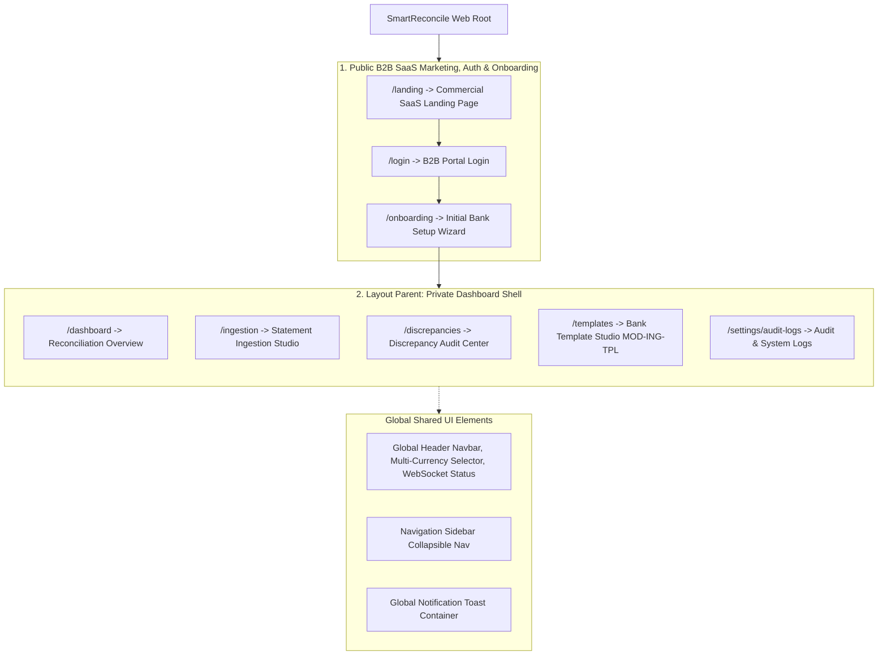

# Master Inventory of Pages (All Pages Index)

**Project:** SmartReconcile  
**Phase:** 4 — System Modeling (D3 Wireframes)  
**Target Stack:** React.js + Tailwind CSS Single-Page Application (SPA)  

---

## Topological Sitemap (Visual Sitemap Diagram)

The following Mermaid diagram maps the complete route hierarchy, public landing conversion funnel, authentication wall, onboarding setup, and private portal routes:

---

## 1. Public B2B SaaS, Auth & Onboarding Routes

Screens designed for commercial conversion, ROI calculations, user authentication, and tenant onboarding.

| Route (URL) | Screen Name | Injected Functional Modules | Figma Design Status | Blueprint Spec Link |
| :--- | :--- | :--- | :--- | :--- |
| **`/landing`** | Public B2B SaaS Landing Page | Marketing Engine, ROI Calculator | ✅ Complete | [`pages/0.landing_page.md`](file:///c:/PROGRAMMING/PROJECTS/SmartReconcile/docs/04-system-modeling/3.wireframes/pages/0.landing_page.md) |
| **`/login`** | B2B Portal Authentication | `MOD-UI` (Auth Guard) | ✅ Complete | [`pages/0.1.login_page.md`](file:///c:/PROGRAMMING/PROJECTS/SmartReconcile/docs/04-system-modeling/3.wireframes/pages/0.1.login_page.md) |
| **`/onboarding`** | Initial Bank & SFTP Setup Wizard | `MOD-ING-TPL`, `MOD-UI` | ✅ Complete | [`pages/0.2.onboarding_page.md`](file:///c:/PROGRAMMING/PROJECTS/SmartReconcile/docs/04-system-modeling/3.wireframes/pages/0.2.onboarding_page.md) |

---

## 2. Private Authenticated Routes (Application Blueprints)

High-density financial operations screens designed for speed, clarity, low cognitive load, and zero-error approval workflows.

| Route (URL) | Screen Name | Injected Functional Modules | Figma Design Status | Blueprint Spec Link |
| :--- | :--- | :--- | :--- | :--- |
| **`/dashboard`** | Reconciliation Overview Dashboard | `MOD-DET` (Matching Core), `MOD-AGT` (AI Status), `MOD-UI` (KPI Metrics & Multi-Currency) | ✅ Complete | [`pages/1.dashboard_page.md`](file:///c:/PROGRAMMING/PROJECTS/SmartReconcile/docs/04-system-modeling/3.wireframes/pages/1.dashboard_page.md) |
| **`/ingestion`** | Bank Statement Ingestion Studio | `MOD-ING` (Statement Ingestion & Vision-LLM), `MOD-UI` | ✅ Complete | [`pages/2.ingestion_page.md`](file:///c:/PROGRAMMING/PROJECTS/SmartReconcile/docs/04-system-modeling/3.wireframes/pages/2.ingestion_page.md) |
| **`/discrepancies`** | Discrepancy Review & Audit Center | `MOD-AGT` (AI Reasoning), `MOD-DET` (Accounting Validation), `MOD-UI` (PDF Report Export) | ✅ Complete | [`pages/3.discrepancies_page.md`](file:///c:/PROGRAMMING/PROJECTS/SmartReconcile/docs/04-system-modeling/3.wireframes/pages/3.discrepancies_page.md) |
| **`/templates`** | Bank Schema Template Studio | `MOD-ING-TPL` (Bank Template Manager), `MOD-UI` | ✅ Complete | [`pages/4.templates_page.md`](file:///c:/PROGRAMMING/PROJECTS/SmartReconcile/docs/04-system-modeling/3.wireframes/pages/4.templates_page.md) |
| **`/settings/audit-logs`** | System Admin & SOC-2 Audit Logs | `MOD-DET` (Audit Ledger), `MOD-UI` (Signed PDF Export & Security Controls) | ✅ Complete | [`pages/5.audit_logs_page.md`](file:///c:/PROGRAMMING/PROJECTS/SmartReconcile/docs/04-system-modeling/3.wireframes/pages/5.audit_logs_page.md) |

---

## 3. Global Cross-Route Components

| Global Component | UI Nature | Injected Functional Modules | Blueprint Link |
| :--- | :--- | :--- | :--- |
| **`AppShell`** | Layout Header & Sidebar | Router & Auth Guard Wrapper | Integrated in All Blueprints |
| **`ToastContainer`** | Floating Notifications | Cross-System WebSocket Alerts | Integrated in All Blueprints |
