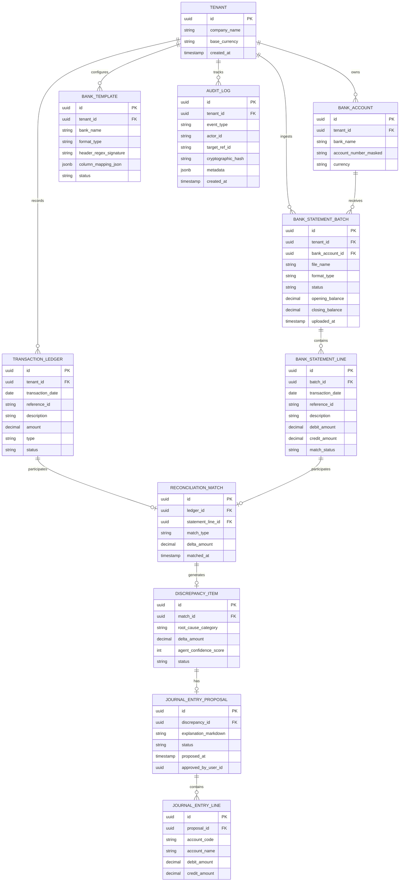

# Deliverable 6: Domain Model & Conceptual ERD [GLOBAL]

**Project:** SmartReconcile  
**Document ID:** D6-DOMAIN-MODEL-ERD  
**Phase:** 4 — System Modeling (Track B Data Architecture)  

---

## 1. Entity Relationship Diagram (Mermaid ERD)

## 2. Relational Schema Data Dictionary

1. **`tenants`:** Multi-tenant organization isolation table.
2. **`bank_statement_batches`:** Metadata header for uploaded CSV/PDF/MT940 files.
3. **`bank_statement_lines`:** Parsed transaction rows from bank statements.
4. **`transaction_ledgers`:** Internal database charges and credits.
5. **`reconciliation_matches`:** Result table associating internal ledgers with bank lines.
6. **`discrepancy_items`:** Unmatched items requiring AI agent diagnosis.
7. **`journal_entry_proposals` & `journal_entry_lines`:** AI-proposed balancing entries verifying $\sum Debits = \sum Credits$.
8. **`bank_templates`:** Cached schema rules for `MOD-ING-TPL`.
9. **`audit_logs`:** SOC-2 compliant append-only event log.
