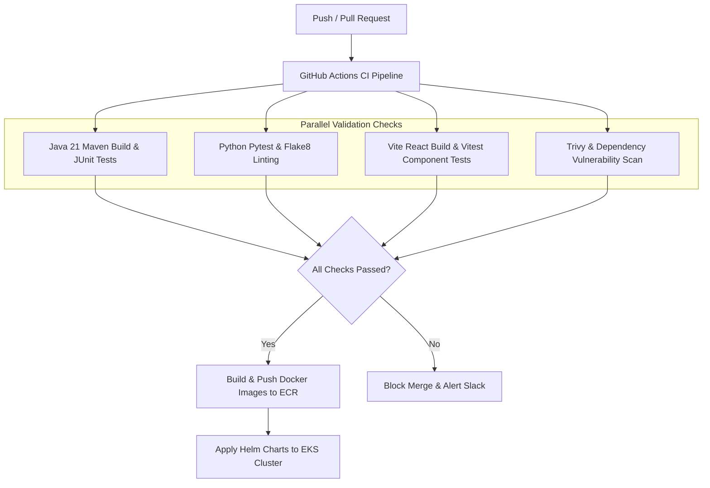

# Deliverable 8: CI/CD & Environments Strategy (D8) [GLOBAL]

**Project:** SmartReconcile  
**Document ID:** D8-CICD-ENVIRONMENTS  
**Phase:** 5 — Architectural Design (Tier 2)  

---

## 1. Environment Architecture Matrix

| Environment | Host Infrastructure | Database & Cache | CI/CD Branch Trigger |
|---|---|---|---|
| **Development (`dev`)** | Local Docker Compose | Local Postgres 16 & Redis 7 | Local feature branches (`feature/*`) |
| **Staging (`stage`)** | AWS EKS Staging Namespace | AWS RDS Postgres & ElastiCache (Staging) | PR merge to `main` |
| **Production (`prod`)** | AWS EKS Multi-AZ Cluster | AWS Aurora Postgres & ElastiCache (Prod) | Tagged release (`release/v*`) |

## 2. GitHub Actions CI/CD Pipeline Workflow

