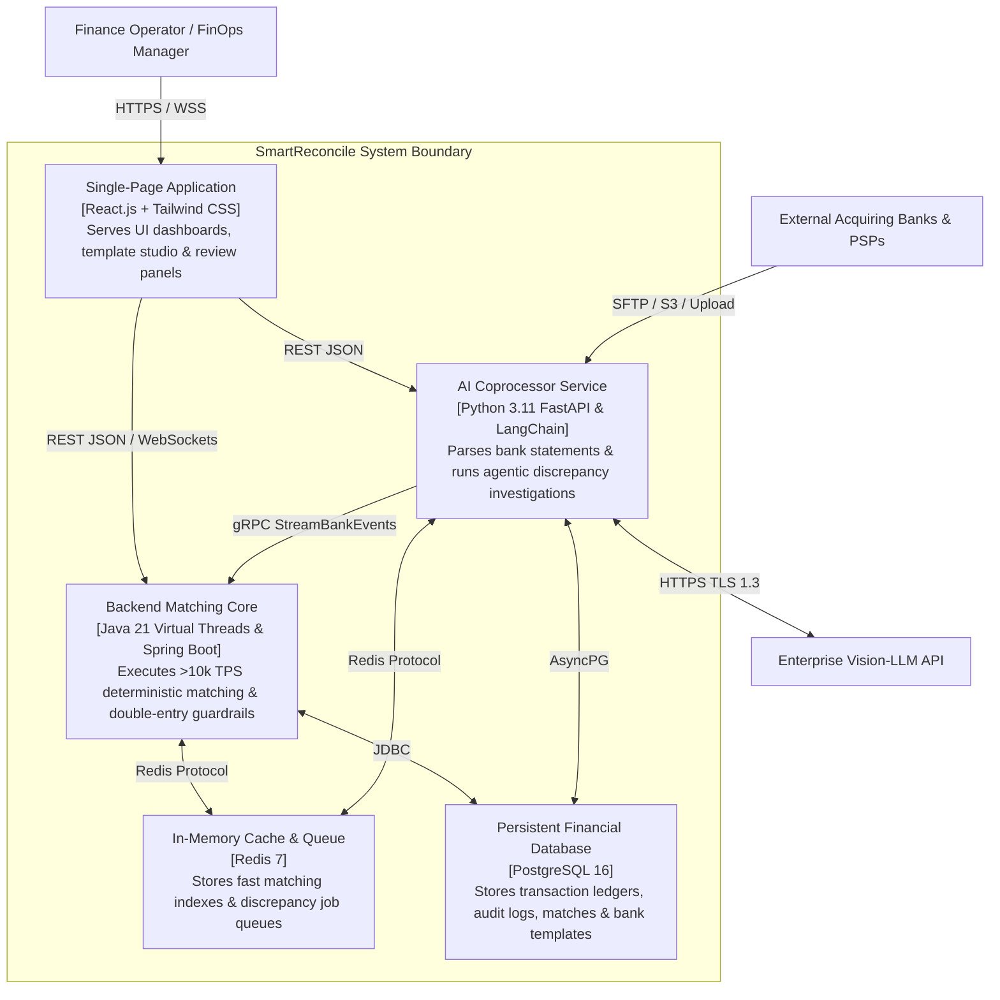

# Deliverable 9: Component Diagram — C4 Container Model (D9) [GLOBAL]

**Project:** SmartReconcile  
**Document ID:** D9-C4-CONTAINER-MODEL  
**Phase:** 5 — Architectural Design (Tier 2 C4 Model)  

---

## 1. C4 Container Level Diagram (Mermaid)

## 2. Container Descriptions & Technology Matrix

1. **React Single-Page Application (`web-ui`):** User interface container built with React.js, Tailwind CSS (Bancolombia palette `#0B192C` / `#FFD200`), Vite, and Axios/WebSockets.
2. **Backend Matching Core (`backend-core`):** Java 21 Spring Boot microservice using Virtual Threads (Project Loom) for high-speed deterministic matching and double-entry validation.
3. **AI Coprocessor Service (`ai-coprocessor`):** Python 3.11 FastAPI microservice using PyMuPDF and LangChain for bank statement table parsing and agentic discrepancy investigation.
4. **Redis Data Store:** Redis 7 container serving as the in-memory exact-match reference index and asynchronous job queue.
5. **PostgreSQL Relational DB:** PostgreSQL 16 relational database maintaining multi-tenant ledgers, audit logs, bank templates, and journal entry proposals.
