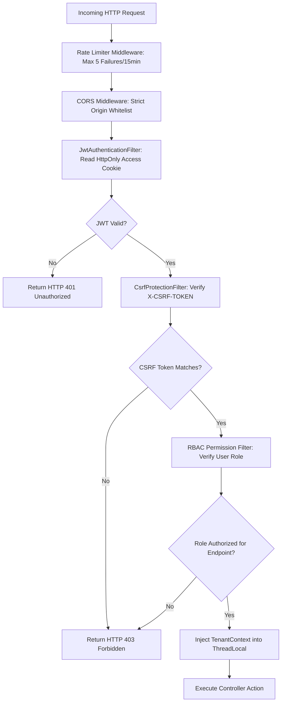

# Deliverable 4: Security Implementation & Middleware (D4) [GLOBAL]

**Project:** SmartReconcile  
**Document ID:** D4-SECURITY-MIDDLEWARE  
**Phase:** 6 — Technical Design (Tier 0)  

---

## 1. Security Architecture & Middleware Pipeline

## 2. Java Security Filter Implementation Details

- **`JwtAuthenticationFilter.java`:** Intercepts HTTP requests, reads the `access_token` HttpOnly cookie, verifies SHA-256 signature, extracts user claims, and sets `SecurityContextHolder.getContext().setAuthentication(...)`.
- **`CsrfProtectionFilter.java`:** Compares incoming `X-CSRF-TOKEN` header against session CSRF secret.
- **`TenantContextHolder.java`:** Stores `tenant_id` in Java `ThreadLocal` memory for implicit multi-tenant SQL data isolation.
