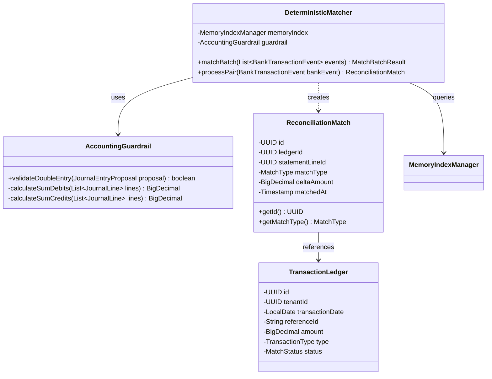

# Deliverable 5: Class & Entity Diagrams [MODULE: MOD-DET]

**Module Code:** `MOD-DET`  
**Document ID:** D5-CLASS-DIAGRAMS-MOD-DET  
**Phase:** 6 — Technical Design (Tier 1 Backend Blueprints)  

---

## 1. UML Class Diagram (Java Core Matching Engine)

